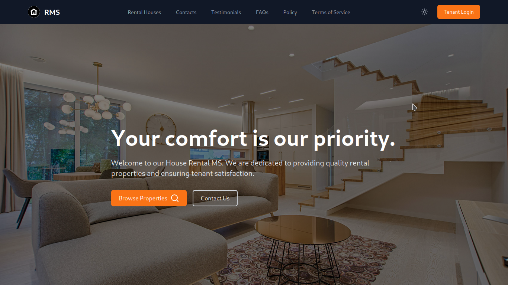
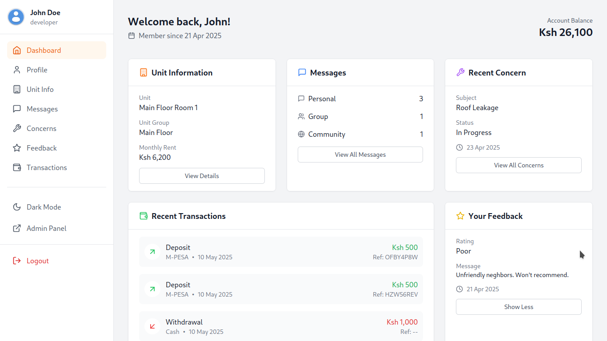
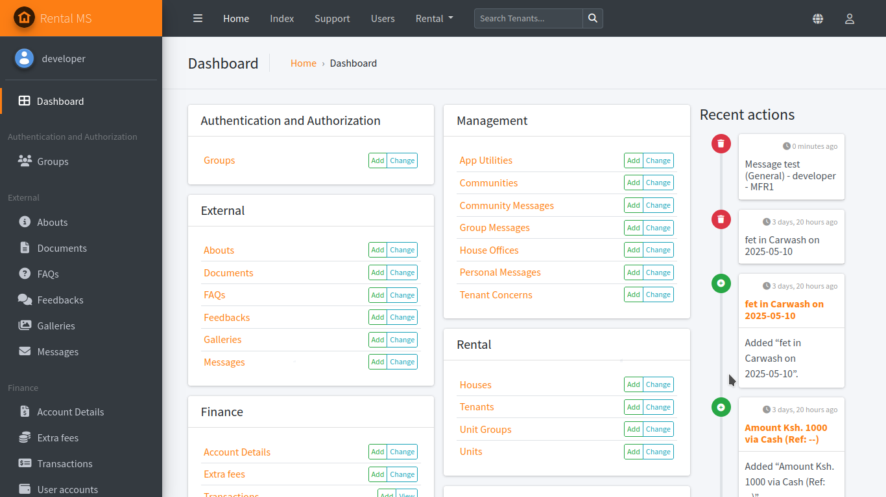

<h1 align="center">🏠 House Rental Management System</h1>

<p align="center">
  <a href="#"></a>
  <a href="#"></a>
  <a href="#"></a>
  <a href="#"></a>
  <a href="https://github.com/Simatwa/house-rental-management-system/blob/main/LICENSE"></a>
</p>

<p align="center">
  A full-stack, user-friendly platform to manage rental properties with ease – built for property managers, tenants, and system admins. 🏘️💼📱
</p>


<h1 align="center">🚀 Demonstrations</h1>

| Role                 | Screenshot                              |
| -------------------- | --------------------------------------- |
| **Landing Page**     |     |
| **Tenant Dashboard** |  |
| **Admin Panel**      |     |


## 🛠 Technologies Used

* ⚙️ **Django** – Handles backend logic, user authentication, and admin interface.
* ⚡ **FastAPI** – Provides a fast, modern, and scalable RESTful API.
* ⚛️ **React** – Powers the frontend with dynamic and interactive components.


## ✨ Key Features

### 🏡 Homepage

* 🏠 View available houses and their unit groupings
* 💬 Send direct messages to management
* 🗣️ See feedback from other tenants
* ❓ Browse FAQs
* 📍 View contact info and location
* 📜 Access Terms of Use and Privacy Policy
* 🌙 Toggle between Light and Dark themes

### 👤 Tenant Dashboard

* 📝 Edit your profile details
* 🏘️ View your rented unit information
* 💰 Recharge account via M-PESA integration
* 💳 Choose from other payment options
* 📩 View personal, group, and community messages
* 🆘 Submit and track concerns
* 💬 Give feedback and track responses
* 📊 View transaction history
* 🌓 Light/Dark theme support

### 🛠️ Admin Panel

* 🏠 Manage houses and their unit groups
* 👥 Manage tenant records
* 💬 Communicate with tenants
* 💸 Process monthly rent
* 📥 Handle tenant concerns
* 📄 Generate various reports


## ⚙️ Installation

> \[!NOTE]
> Ensure [Python ≥ 3.13](https://www.python.org/) and [Git](https://git-scm.com/) are installed.

```bash
# Clone the repository
git clone https://github.com/Simatwa/house-rental-management-system.git
cd house-rental-management-system/backend

# Set up a virtual environment
pip install virtualenv  # If not already installed
virtualenv venv

# Activate the virtual environment
source venv/bin/activate        # macOS/Linux
.\venv\Scripts\activate         # Windows

# Install Python dependencies
pip install -r requirements.txt

# Set up Django
python manage.py makemigrations users finance external rental management
python manage.py migrate
python manage.py collectstatic

# Create a superuser with preset credentials
python manage.py createsuperuser --username developer --email developer@localhost.domain --identity_number 12345678 --noinput

# Start FastAPI server
python -m fastapi run api
```

> [!TIP]
> Consider using **make** command provided by [Makefile](backend/Makefile) for a more smoother control. e.g `$ make install setup developmentsuperuser runserver-prod`

## 🌐 Available Endpoints

| Page                      | URL          |
| ------------------------- | ------------ |
| 🏠 **Home**               | `/`          |
| 🛠 **Admin Panel**        | `/d/admin`   |
| 📘 **API Docs (Swagger)** | `/api/docs`  |
| 📕 **API Docs (ReDoc)**   | `/api/redoc` |

> [!IMPORTANT]
> **Admin Login**
> Username: `developer`
> Password: `development`

## 🙏 Acknowledgements

Special appreciation to **Miss Mwikali** for the idea, trusting me in delivering this and funding of the project – and finally for allowing it to be open-sourced.

## 🤝 Contributions Welcome

Have ideas for improvements or features? Found a bug?
Feel free to open a pull request! Let's collaborate and build a better platform together. 🚀

## 📄 License

This project is licensed under the [GPLv3 License](LICENSE).
